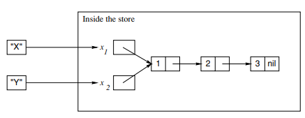

# Declarative Computation Model

Declarative programming: defined as evaluating functions over partial data structures. Sometimes called stateless programming.

## Defining Practical Programming Languages

- **Syntax:** Grammar
- **Semantic:** Meaning

### Language Syntax

Define legal programs that can be successfully executed.

#### Grammars

A set of rules that defines how to make a _sentence_ out of _words_.

- **Sentences:** Statements
- **Words:** Tokens

1. Statement = sequence of tokens
2. Token = sequence of characters

- **Tokenizer / Lexical analyzer:** Takes a sequence of characters and returns a sequence of tokens.
- **Parser:** Takes a sequence of tokens and returns a parse tree.

#### Extended Backus-Naur Form (EBNF)

Common notation for defining grammar.

##### _Terminal symbol_

A token

##### _Nonterminal symbol_

Sequence of tokens

```
<digit> ::== 0|1|2|3|4|5|6|7|8|9
```

```
<int> ::== <digit> { <digit> }
```

#### Context-free and Context-sensitive Grammars

##### _Context-free_

The expansion of a nonterminal is always the same no matter where it is used.

##### _Context-sensitive_

Contains nonterminal that are dependent on the context of where it is used.

E.g. in many languages, a variable has to be declared before it is used. The nonterminal that used the variable must only allow the use of already-declared variables.

#### Ambiguity

Context-free grammar can have several parse trees that correspond to the same token sequence. To solve this, we add extra conditions.

```
2*3+4 = (2*3)+4 | 2*(3+4)
```

- **Precedence:** Each operator is given a precedence level. High precedens are put as deep in the parse tree as possible.
- **Associativity:** Determines whether the leftmost or the rightmost operatos binds tighter. `2-3-4 = (2-3)-4 | 2-(3-4)`

### Language Semantics

Defines what a program does when it executes.

#### The Kernel Language Approach

All language constructs are defined in terms of translations into a core language known as the kernel language.

Each computation model has its kernel language, which builds on its predecessor.

#### Linguistic Abstracion

A new construct that is an abstraction and an addition to the language syntax. E.g. the declarative model has no looping constructs.

Two phases to defining linguistic abstraction:

1. Define a new grammatical construct
2. Define its translation into the kernel language

#### Syntactic Sugar

Shortcut notation for frequently occurring idioms. _Does not provide new abstractions_

## The Single-assignment Store

A set of variables that are initially unbound and that can be bound to one value.

### Declarative Variables

Variables in the single-assignment store are declarative variables.

Once bound, the variable stays bound throughout the computation and is indistinguishable from its value.

### Value Store

A store where all variables are bound to a value.

### Value Creation

Binding a variable to a newly created value

If the variable is already bound, the operation will test whether the two values are compatible.

### Variable Identifiers

A textual name that refers to a store entity from outside the store.

The mapping from a variable identifier to a store is called an **environment**.

### Value Creation with Identifiers

Binding the variable identifier X to the list [1 2 3] would look like this:

```
X = [1 2 3]
```

The `=` sign is the bind operation. After the bind completes, the identifier `X` refers to `x_1`, which is now bound to `[1 2 3]`

### Partial Values

A data structure that may contain unbound variables.

### Variable-variable Binding

Example: two unbound variables `x_1` and `x_2` referred to by identifiers `X` and `Y`. Doing `X=Y`, then `X=[1 2 3]` will result in:



### Dataflow Variables

Declarative variables that cause the program to wait until they are bound.

#### Detailed Explanation

In the declarative model, creating and binding a variable are done separately. When using the variable before it is bound, it is called a variable use error (functional programming languages create and bind variables in one step, preventing this error).

Five different ways of handling use errors:

1. Execution continues and no error is given. The variable is undefined. (C++)
2. Execution continues and no error is given. The variable is initialized to a default value. (Java)
3. Execution stops with an error. (Prolog)
4. Execution is not possible as the compiler detects that there is an execution path to the variable's use that does not initialize. (Java for local variables).
5. Execution waits until the variable is bound and then continues. (Oz)

The last one is good for concurrent systems, as a normal operation in another thread can bind the variables. However, it can cause **suspension** that waits forever, for example, if a variable name is misspelled and is never bound.

Declarative variables that cause the program to wait until they are bound are called dataflow variables.

## Kernel Language

### Dynamic vs Static Typing

- **Static typing:** All variable types are known at compile time
- **Dynamic typing:** The variable type is known only when the variable is bound.

_The declarative model is dynamically typed._

### Records and Procedures

#### Symbolic Languages

Symbolic languages are languages that provide high-level support for records. Makes it easy to create them, take them apart, and manipulate them.

## Kernel Language Semantics

### Basic Concepts

#### Procedures

```
proc {Max X Y Z}
    if X >= Y then Z = X else Z = Y end
end

{Max 3 5 C}
```

The code above will bind `C` to the maximum value of `X` vs `Y` (`5`). When the call to `Max` is made, the `X`, `Y`, and `Z` are bound to `3`, `5`, and the unbound variable referenced by `C`. When `Max` binds `Z`, then it binds this variable. Since `C` also references this variable, this also binds `C`. This is called **call by reference**.

#### Static scoping

The variable corresponding to an identifier occurrence is the one defined in the textually innermost declaration surrounding the occurrence in the source program.

```
local Y LB in
    Y = 10
    proc {LB X Z}
        if X >= Y then Z = X else Z =Y
    end
    local Y = 16 Z in
        {LB 5 Z}
    end
end
```

_Z would be bound to 10_

#### Dynamic scoping

The variable corresponding to an identifier occurrence is the one in the most recent declaration seen during the execution leading up to the current statement.

```
local P Q in
    proc {Q X} {Browse stat(X)} end
    prox {P X} {Q X} end
    local Q in
        proc {Q X} {Browse dyn(X)} end
        {P hello}
    end
end
```

_With dynamic scoping `dyn(hello)` would be the output as the call to `P` would use the most recent value of `Q`_

#### Static vs Dynamic Scoping

Static is the most safe option as the procedure that works when it is defined will always work.

### The Abstract Machine

Define the semantics of the kernel language with the use of an abstract machine. Need to define the basic concepts of the machine:

#### Definitions

- A `single-assignment store σ` is a set of store variables.
- An `environment E` is a mapping from variable identifiers to entities in a store (`σ`). Write `E` as a set of pairs, `{X -> x, Y -> y}`
- A `semantic statement` is a pair `(<S>, E)` where `<S>` is a statement and `E` is an environment.
- An `execution state` is a pair `(ST, σ)` where `ST` is a stack of semantic statements and `σ` is a single-assignment store.
- A `computation` is a sequence of execution states starting from an initial state: `(ST_0, σ_0) -> (ST_1, σ_1) -> (ST_2, σ_2) -> ...`

## Memory Management

### Tail-Recursive Calls

- Recursive functions with one recursive call which is the last call in the procedure body.
- The semantic stack is bounded by a constant size.
- The store grows for each call. (Not a problem as the semantic stack only needs the last entry in the store, meaning we can remove the not-needed variables)

### Memory Life Cycle

A running program needs only the semantic stack and the variables in the stores that are reachable from the semantic stack. Together these are called the active memory.

Memory is divided into blocks. These can be in three different stages and cycle through them during the execution of a program:

- **Active:** Memory that is currently used by the program
- **Inactive:** Memory that is no longer reachable by the program
- **Free:** Memory that is free to be claimed

The problem is to understand when memory is **inactive** so it can be made **free** again (C and C++ make this the developer's responsibility).

### Garbage Collection

Reclaiming of **inactive** memory is done by the system (e.g. Java).

Two phases:

1. Determines what active memory is. (Finds all data structures reachable from an initial set of pointers (the root set))
2. Collects the active memory into one contiguous block and the free memory blocks into one contiguous block.

Most garbage collectors are idle until a predefined threshold of memory usage is met. Then the garbage collector runs, halting the program until it's done. There are garbage collectors that can run continuously, interleaved with the program execution.

## From Kernel Language to Practical Language

Kernel language is too minimal. Syntactic sugar and linguistic abstracions can be added to make it more complete.

### Expression

A sequence of operations that returns a value

```
11*11       # This is an expression
X = 11*11   # This is a statement that uses the expression above
```

[//]: # 'p. 108'
