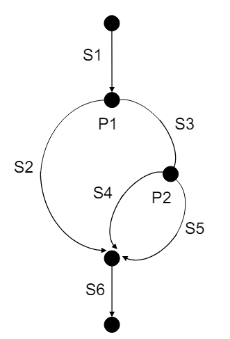

# Exam Prep Notes

## Explain different requirement elication and documentation approaches

### RSL (requirement specification languages)

#### Guided natural language

- Use words from predefined dictionary
- Avoids vague words and terms
- Retain benefit of free text
- Does not introduce additional formal constraints
- Requires minimal expertise

#### Boilerplate-based RSL

- The _system name_ shall _function_ _object_ every _performance_ _units_
- The _coffee machine_ shall _produce_ _a hot dring_ every _10_ _seconds_

##### User storis

A type of boilerpalte based RSL

### Requirement elication (kravfremkalling)

- Interviews: Interviews with stakeholders to gather requirements
- Workshops: Sessions that bring multiple stakeholders together to discuss requirements
- Questionnaires: Distribute to large number of people to collect responses on specific questions
- Observation: Observer users in their work envrionmnet to understand the task they are performing.
- Document analysis: Review existing documentation to extract system requirments.

### Documentation approaches:

- Complete: All possible situtations must be covered
- Unambiguous: Cant be interpreted in different ways
- Consistent: Does not conflict with other requirements
- Correct: Reflects the inteded purpose and functions envisioned by stakeholders.
- Verifiable: Can check if the final product meets the requirment
- Traceable: Can be linked to its origin in the specifications, design, implementation, and testing.

## Identify qualiy issues of requirements and fix them

### Example

- Requirement: _Reverse thrust may only be used <u>when the airplane is landed</u>_
- Translation: _Reverse thrust may only be used <u>while the wheels are rotating</u>_
- Implementation: _Reverse thrust may only be used <u>while the wheels are rotating fast enough</U>_

## Define different functional and non-functional requirements

### Example Functional

- As a user, I should be able to log into my account using my email and password.

### Example Non-Functional

- The system should be able to handle a request load of up to 1000 request per minute.

## Explain the coverage criteria explained in the lectures

- Statement coverage: Each statement in the code has been executed at least one.
- Decision coverage: Each of the possible branch from each decision point is executed at least once.
- Path coverage: All possible paths of the software should be tested.

## Create test cases by using different data flow testing strategies

- Statment/decision/path
- White box testing: use the code and validate that all lines are reached through the tests

### McCabes Cyclomatic Complexity

$v(G) = E - N + P*$

- E = number of edges
- N = number of nodes
- P = nuber of connected components

$v(G) \le number of paths \le 2^{|{predicates}|}$

### Decicison table

| P1  | P2  | Test description or reference |
| --- | --- | ----------------------------- |
| 0   | 0   | S1, S3, S5, S6                |
| 0   | 1   | S1, S3, S4, S6                |
| 1   | 0   | S1, S2, S6                    |
| 1   | 1   | S1, S2, S6                    |

## Explain how to use the test coverage information for different purposes

- Use as test acceptance criteria (E.g. "the system shall aim for 85% decision coverage")

## Apply domain testing approach to generate test cases of single variable and multiple variables in combination

### Single variable example

BankA has a credit limit between \$4_000 to \$40_000.

- Identify the variable: "credit-limit"
- Determine the input domain: $\$4,000 \le credit-limit \le \$40,000$
- Identify risks:
  - Failure to process credit limit request between the range correctly
  - Failure to disapprove credit limit requests less that \$4,000
  - Failure to disapproce credit limit requests greater than \$40,000
  - Mishandling of negative credit limit request
- Partion the input domain into equivalance classes based on risks:
  - \$4.000, \$40.000
  - \$3999
  - \$4001
  - \$39.999
  - \$40.001
  - -\$4000

### Multivariable appication

- All variables will interact as they are part of one functional unit and they have to unite to achieve the duty that the functional unit is designated for, so they influence each other

#### Do we need to test all combination?

- Root cause of many bugs shows they depend on the value of one variable
- Most defects can be discovered in tests of the interactions between the values of two variables

#### n-way test

- A system with n variables, every combination of values of these n variables is covered in at least on test.
- E.g an application with 5 variables: 2-way - Every combination of values of any 2 variables is covered in at least on test

## Random testing

- Feed random input to the system
- Observe if the system behaves as expected:
  - Execution satisfies the given specification
  - Or it just does not crash

### Random testing for security

- Identifying vulnerabilities
  - Random attack inputs
  - injection attacks

### Random testing for concurrent programs

- The sequences of thread execution is undeterministic
- Introduce `sleep()` to check for different scheduling, does the system still work?

## Risk based testing

- Testing features based on their risk of failure and the impact of such failures.

1. Risk identificaiton
2. Risk assessment
3. Test planning
4. Test execution
5. Risk mitigation
6. Monitoring and review

- Spend resources and budget on the functionality that has high risks and high impact.

## Explain different approaches for creating integration test cases and their pros and cons

### Top-down

- Begin with main
- Use "stubs" to simulate called functions
- Replace stubs with real functions one by one

### Bottom-up

- Begin with leaves
- Use "drivers" to emulate functions calling the leaves
- Replace "drivers" with real function later

#### Pros & Cons

- Incremental and intuitive
- Easy fault isolation

- Need "stub" or "driver"

### Sandwich

- Mix of top-down and bottom-up

### Incremental

- Testing is conducted incrementally as a series of test cycles

#### Pros & Cons

- Do not need "stub" or "driver"
- Test more global and complex intergrations
- Closely coupled with actual system behavior

- Difficult fault isolation
- Extra effort is needed to identify message path

### Big bang

- Test modules individually
- Put them all together to construct the entire system which is tested as a whole
- Not recommended for big systems

## Explain focuses of different types of system tests

- Functionality: Verify that all modules function individually
- GUI: accessibility, responsiveness, efficiency, comprehensibility
- Interoperability: Verify the ability of the system to inter-operate with third-party products
- Performance: Test the performance of a system compared to the expected
- Robustness: Test how sensitive the system is to erroneous inputs or changes in env
- Scalability: The magnitude of demand the system can handle while continuing to meet performance requirements
- Stress: System can perform acceptably under the worse-case condition
- Load and stability: Ensure the system remains stable for a long period of timer under full load
- Security: Make sure the system is secure
- Regulatory
- Safety assurance: For safety-critical systems -> focus on identifying and mitigating harzards

## Create different system test cases

## Explain different categories of acceptance test case

- Confirm that the system meets the agreed acceptance criteria

- User acceptance testing: Functions are correct?
  - system requirements, business requirements, use cases, etc...
- Operational testing: Ready to operate?
  - Backups
  - Procedures for disaster recovery
  - Training/manual for end-user
  - Maintenance manuel/procedures
  - Security procedures
- Contract and regulation acceptance testing: Test against regulration
  - Government regulation
  - Legal standards
  - Safety standards
- Alpha and beta testing:
  - Alpha: At developer, by internal staff, before release
  - Beta: At customer, before release to other customer

## Explain different test prioritzation approaches

TODO:

## Explain regression test selection approaches

TODO:

## Explain different regression tet minimization and prioritization strategies

### Prioritization

- Ranking tests on some criteria
- Goal of revealing critical faults early

#### Strategies

- Coverage based (high coverage)
- Cost-aware based (low cost to run, high fault-finding probability)

## Explain why code inspection and testing complete each other

- Testing does not find all defects in a code. Code review usually finds different defects then what the test does.
- Test can not find code smells, where as code review can.
- Tests can only be implemented in the code, where as review can be used in other areas such as documentation.
- Reviews can help a team share knowledge and best practises
- Tests are only a spot check, where as a reviewer can see the bigger picture

## Understand different types of code smell

### Bloaters

- Large method/classes that are hard to work with
- Long parameter list -> Introduce parameter object
- Primitive obsession: Code relies too much on primitives
- Data clumps: Bunches of data often hang together

### Object-oriented Abusers

- Alternative classes with different interfaces: Two classes are similar on the inside but are different on the outside (method names and signatures)
- Refused bequest: Wrong hiearchy (e.g. chair is not an animal just because it has legs)
- Switch statement: Over use of switch statements
- Temporary fields: Classes have variables that are only used in some situations

### Change Preventers

- Divergent Change: One module is often changed in different ways for different reasons, violation of single responsibility
- Shotgun surgery: Single change is made to multiple classes simultaneously.
- Parallel inheritance hierarchies: When creating a sub-class for a class, you need to create a sub-class for another class

### Dispensables

- Comments: Can quickly get outdated
- Data class: A class primarly contains data fields with no behaviour
- Laze class: A class that isn't enough to pay for itself should be eliminated
- Duplicated code: DRY
- Dead code: Code that is no longer in use
- Speculative generality: Code that isn't needed today (might be needed in the future)

### Couplers

- Feature envy: A function in one module spends more time communicating with other modules than it does within its own
- Inappropriate intimacy: Two classes that are tightly linked to each other
- Message chains/Middle man: A class/method in the middle that doesn't do anything other than to forward it

## Explain unsystematic vs systematic reading techniques

- Unsystematic review is where you read to the changes as you like
- Semi-Systematic is where you have a checklist that you go through to make sure all the point are met
- Systematic
  - Defect reading: each reader is given a responsibility to discover a particular class of defects
  - Perspective-based reading: each reader reviews changes from a specific point of view (end-user, designer, tester)

## Explain the purpose and steps of code refactor

- Goal: Change the internal structure without changing the external behavior
- Used to eliminate code smells

### Steps

1. Implement solid test cases to make sure refactoring changes does not change the behavior of the system
2. Review code to identiy smelly code
3. Refactor the identified smelly code blocks and re-run tests (one step at a time)

## Understand the trade-off of using different software engineering practices in different application odmain and project contexts

TODO:

## Explain importance and challenges in software sustainability

- Physical: Infrastructure and hardware is physical -> uses a lot of energy -> manufactorung/shipping, power/cooling
- Social threats: human rights violations, digital inequalities, mental health issues, democracy, privacy, freedom, and peace

## Describe different aspects of software sustainability

- Social: effects the system have on society
- Economic: create software so that stakeholders long-term investments are safe from economic risks
- Individual: create software so that developers are satisfied with their job over longer periods
- Technical: make software that can adapt to future changes
- Environmental: how software impacts envoronent during development, usage and maintanence

## Explain the elements that influence software scalability

- Processing capacity (load):
  - CPU: instructions per seconds
  - Database: transactions per seconds
  - Network: bits per second
- Information capacity (work):
  - Sizes of caches
  - Size of primary & secondary memory
- Connectitity (access points to the system):
  - Routers

## Explain the relationship between scalability, elasticity and cost-efficiency

- Scalability: Ability to increase capacity by consuming more resources
- Elasticity: Degree of autonomously adapting capacity to the workload over time
- Cost-efficiency: Measure of optimal versus the actual cost of resources

## Explain how to build scalable software with agile

1. Define user stories
2. Scalability triage
3. Extract business related scalability concerns

- Result:
  - Product backlog: User stories with scalability concerns
  - Use this as reference for sprint backlog

4. Sprint planning with DoD and expert evaluation
5. Development with QA
6. Scalabilit testing
7. Sprint review

## Explain the challenges of manual deployment

- Missing dependencies/wrong versions
- Wrong ports open in firewall
- If not done regularly, steps of how to deploy can be lost

## Explain how GitHub actions works

- Define a pipeline file (.yml):
  - Trigger: When the pipeline should be triggered
  - Jobs: The different jobs the pipeline should execute
  - Steps: The different steps each job has to do

## Explain the essential ideas of using different types of machine learning approaches in software engineering practices

- Supervies learning: Training data + desired outputs
- Unsupervised learning: Training data
- Reinforcement learning: Envorionment and reward criteria

## Explain the challenges and best practices of software engineering for AI in development stage

- Model requirement:
  - Understand the domain
  - Understand the state of the practice
  - Understand needs
  - Confirm assumptions
- Feature engineering
  - Selecting, manipulating and transforming raw data into features that can be used by a model
- Model training
- Model evaluation

## Explain challenge of deploying AI-based systems

- Scalability
- Managing model updates
- Maintaining security
- Handling real-time data processing
- Integrating with existing systems

## Explain how to define system integrity level

## Explain advantages and challenges of using simulation-based testing

### Advantages

- Safety: test scenarions that could be dangerous in real world
- Cost-effective: reduces need for phsical prototypes and real world trials
- Controlled environment: consistent and repeatable testing environment
- Early detection: identify issues and bugs early in development process
- Flexibility: enables testing of a wide range of conditions and edge cases

### Challenges

- Realism: lack of complexity and unpredicatbility of real world
- Model accuracy: Need accurate models to ensure valid test results
- Resource intensive: can require significant computational resources
- Over-reliance: risk of relying too much on simulation results without sufficient real world testing
